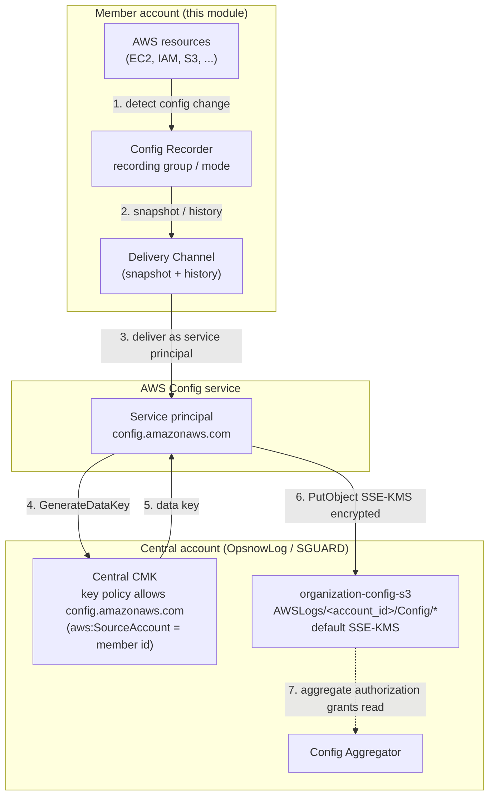

# AWS Config Recorder Terraform module

Provisions a single **AWS Config Configuration Recorder** (plus its Delivery Channel, service IAM Role, and an optional cross-account aggregate authorization) inside the account/region the caller's AWS provider points at. Designed to be applied **once per member account per region** from an organization, delivering Config snapshots/history to a central S3 bucket encrypted with a central KMS CMK.

This module manages:

- `aws_config_configuration_recorder` — the recorder and its recording group / recording mode
- `aws_config_configuration_recorder_status` — enables the recorder
- `aws_config_delivery_channel` — delivery to the central bucket (SSE-KMS)
- `aws_iam_role` (+ managed policy attachment + inline delivery policy) — the Config service role
- `aws_config_aggregate_authorization` — optional authorization for the central Aggregator

It supports the three mutually exclusive recording strategies — **ALL_SUPPORTED** (default), **INCLUSION** (allow-list), and **EXCLUSION** (deny-list) — and per-type recording-frequency overrides for a cost-first `DAILY` baseline with selected types pinned to `CONTINUOUS`.

## Architecture

```
  Member account (this module)                 Central account (OpsnowLog / SGUARD)
  ┌───────────────────────────────┐
  │ Config Recorder               │              ┌──────────────────────────────────┐
  │   └─ recording group / mode   │              │  organization-config-s3 (bucket) │
  │ Delivery Channel ─────────────┼── SSE-KMS ─▶ │    AWSLogs/<account_id>/Config/* │
  │ IAM Role (OrganizationAWS…)   │   PutObject  │  central CMK (key policy trusts  │
  │   └─ inline delivery policy   │◀── KMS ───── │    config.amazonaws.com)         │
  │ Aggregate Authorization ──────┼─────────────▶│  Config Aggregator (SGUARD)      │
  └───────────────────────────────┘   read       └──────────────────────────────────┘
```

- **Delivery** — the recorder hands snapshots/history to the Delivery Channel, which writes to `s3://<central_config_bucket>/AWSLogs/<account_id>/Config/*`, encrypted with the central bucket's default SSE-KMS key.
- **Service-principal access** — AWS Config delivers as the service principal `config.amazonaws.com`. The central bucket policy and central CMK key policy grant this principal (scoped by `aws:SourceAccount = <member account id>`), so the module needs no KMS input and grants no per-key IAM permission. This works for both the custom role and the service-linked role (`AWSServiceRoleForConfig`).
- **Aggregation** — workload accounts issue an aggregate authorization so the central Aggregator can read their Config data.

### Delivery flow

How a configuration change becomes an encrypted object in the central bucket:



## Prerequisites

1. **Central S3 bucket** (`central_config_bucket`) exists, with a bucket policy that allows `s3:PutObject` / `s3:GetBucketAcl` for `config.amazonaws.com` (scoped by `aws:SourceAccount`), and a default SSE-KMS encryption.
2. **Central CMK key policy** grants `config.amazonaws.com` (`kms:GenerateDataKey` / `kms:Decrypt`, scoped by `aws:SourceAccount`) so delivered objects can be encrypted with the bucket's default key.
3. The caller configures the **AWS provider** for the target member account/region (this module declares no `provider` block).
4. Apply **once per member account per region**.
5. **Service-linked role check** — when `config_role_name` is empty (service-linked-role mode), verify up front whether the account already has `AWSServiceRoleForConfig`. Terraform cannot detect this at plan time, and `aws_iam_service_linked_role` fails if the role already exists. Run:

   ```bash
   aws iam get-role --role-name AWSServiceRoleForConfig
   ```

   - **`NoSuchEntity` error** → the role does not exist → set `create_config_service_linked_role = true` so the module creates it.
   - **Role details returned** → the role already exists → keep `create_config_service_linked_role = false` (default) so the module references it instead of recreating it.

   Skip this check when `config_role_name` is set (the module manages its own custom role).

## Deployment scenarios (member accounts)

Pick the scenario that matches the account's purpose. Every scenario expects a [`module.ctx.context`](#context-module-tfmodule-context) plus the `central_config_*` inputs; only the distinguishing arguments are shown.

| Scenario                                    | `all_supported` | `recording_frequency` | `include_global_resource_types` | `enable_aggregate_authorization` | Notes                                        |
| ------------------------------------------- | :-------------: | :-------------------: | :-----------------------------: | :------------------------------: | -------------------------------------------- |
| A. Standard workload (home region)          | `true`          | `DAILY`               | `true`                          | `true`                           | Recommended default; cost-first              |
| B. Multi-region workload (secondary region) | `true`          | `DAILY`               | `false`                         | `true`                           | Avoid double-recording global resources      |
| C. Security / compliance-critical           | `true`          | `CONTINUOUS`          | `true`                          | `true`                           | Full change history; higher cost             |
| D. Cost-optimized dev / sandbox             | `true`          | `DAILY`               | `true`                          | `true`/`false`                   | Mandatory-only CONTINUOUS; slow snapshots    |
| E. Scoped audit (specific types)            | `false`         | `CONTINUOUS`          | n/a (forced `false`)            | `true`                           | INCLUSION allow-list                          |
| F. Non-workload (mgmt / log / aggregator)   | `true`          | `DAILY`               | `true`                          | `false`                          | Stays off the aggregator surface             |
| G. Pause recording                          | —               | —                     | —                               | —                                | `recorder_enabled = false`                    |

### Context module (`tfmodule-context`)

The `context` input is **not** hand-written per stack. It is produced by the shared [`tfmodule-context`](https://github.com/oniops/tfmodule-context) module, which takes the project's standardized attributes and emits a normalized `context` object (`region`, `project`, `name_prefix`, `pri_domain`, `account_id`, `tags`, …) consumed by every downstream module. Declare it once per root stack and pass `module.ctx.context` into this module:

```hcl
module "ctx" {
  source = "git::https://github.com/oniops/tfmodule-context.git?ref=v1.3.5"
  context = {
    project     = "andev"
    region      = "ap-northeast-2"
    environment = "Development"
    owner       = "aws_alertnow_dev@opsnow.com"
    domain      = "opsnow.com"
    pri_domain  = "alertnowdev.opsnow.com"
    customer    = "AlertNow Development"
    department  = "AlertNow"
  }
}
```

All samples below reference `module.ctx.context`. `module.ctx.context.account_id` (12-digit) scopes the S3 delivery prefix and the trust-policy `aws:SourceAccount` condition, so ensure the context module resolves it for the target account.

### Quick start

Minimal standard member-account deployment (Scenario A). The other scenarios below reuse this `module` block and change only the highlighted arguments.

```hcl
module "config_recorder" {
  source = "git::https://github.com/oniops/tfmodule-aws-config-recorder.git?ref=v1.0.0"

  context = module.ctx.context

  central_config_bucket      = "organization-config-s3"
  # Scenario A: ALL_SUPPORTED + DAILY (cost-first). The AWS-mandated
  # CONTINUOUS-only AWS::Config::* types are auto-pinned by the module.
  enable_aggregate_authorization = true

  tags = { ManagedBy = "terraform" }
}
```

### B. Multi-region workload — secondary (non-home) region

Disable global resource recording on non-home regions so IAM/etc. are recorded (and billed) only once.

```hcl
module "config_recorder" {
  source = "git::https://github.com/oniops/tfmodule-aws-config-recorder.git?ref=v1.0.0"
  # provider configured for the secondary region, e.g. us-east-1

  context = module.ctx.context # ctx module region = "us-east-1"
  central_config_bucket      = "organization-config-s3"  include_global_resource_types = false # home region records globals; this region skips them
  enable_aggregate_authorization = true # authorization is per-region
}
```

### C. Security / compliance-critical account

Continuous recording of every supported type for a full change history, with frequent snapshots.

```hcl
module "config_recorder" {
  source = "git::https://github.com/oniops/tfmodule-aws-config-recorder.git?ref=v1.0.0"

  context = module.ctx.context
  central_config_bucket      = "organization-config-s3"
  recording_frequency         = "CONTINUOUS" # base CONTINUOUS; no DAILY-forbidden-type pinning needed
  snapshot_delivery_frequency = "Three_Hours"
  enable_aggregate_authorization = true
}
```

### D. Cost-optimized dev / sandbox account

`DAILY` everywhere (the mandatory `AWS::Config::*` types are auto-pinned to `CONTINUOUS`), slowest snapshot cadence.

```hcl
module "config_recorder" {
  source = "git::https://github.com/oniops/tfmodule-aws-config-recorder.git?ref=v1.0.0"

  context = module.ctx.context
  central_config_bucket      = "organization-config-s3"
  recording_frequency         = "DAILY"
  snapshot_delivery_frequency = "TwentyFour_Hours"
}
```

### E. Scoped audit account (record specific types only)

INCLUSION strategy — e.g. a network/security review account that records only the relevant types. See [Recording strategies](#recording-strategies) for the rules.

```hcl
module "config_recorder" {
  source = "git::https://github.com/oniops/tfmodule-aws-config-recorder.git?ref=v1.0.0"

  context = module.ctx.context
  central_config_bucket      = "organization-config-s3"
  all_supported = false
  resource_types = [
    "AWS::EC2::SecurityGroup",
    "AWS::EC2::NetworkAcl",
    "AWS::IAM::Role",
    "AWS::IAM::Policy",
  ]
  recording_frequency            = "CONTINUOUS"
  enable_aggregate_authorization = true
}
```

### F. Non-workload account (management / log / aggregator)

Records locally but stays off the aggregator surface — leave `enable_aggregate_authorization` at its default `false`.

```hcl
module "config_recorder" {
  source = "git::https://github.com/oniops/tfmodule-aws-config-recorder.git?ref=v1.0.0"

  context = module.ctx.context
  central_config_bucket      = "organization-config-s3"
  # enable_aggregate_authorization defaults to false
}
```

### G. Pause recording (keep resources)

Stop capturing without destroying the recorder, channel, or role.

```hcl
module "config_recorder" {
  source = "git::https://github.com/oniops/tfmodule-aws-config-recorder.git?ref=v1.0.0"

  context = module.ctx.context
  central_config_bucket      = "organization-config-s3"
  recorder_enabled = false
}
```

## Recording strategies

The three strategies are mutually exclusive. The examples below show the mechanics of each; the [scenarios](#deployment-scenarios-member-accounts) above show when to use them.

### All supported resource types (default)

`all_supported = true` (the default) records every current and future supported type, including global resources (IAM, etc.). With `recording_frequency = "DAILY"` the `AWS::Config::*` types that AWS forbids from `DAILY` are auto-pinned to `CONTINUOUS` by the module — no extra input needed. See the [Quick start](#quick-start) for a full example.

### Inclusion strategy (explicit allow-list)

Records only the listed types. `all_supported` must be `false`. Any type given a frequency override must also appear in `resource_types`.

```hcl
module "config_recorder" {
  source = "git::https://github.com/oniops/tfmodule-aws-config-recorder.git?ref=v1.0.0"

  context = module.ctx.context

  central_config_bucket      = "organization-config-s3"
  all_supported = false
  resource_types = [
    "AWS::EC2::Instance",
    "AWS::EC2::SecurityGroup",
    "AWS::S3::Bucket",
  ]

  recording_frequency = "CONTINUOUS"
}
```

### Exclusion strategy (deny-list)

Records every supported type except the listed ones. `all_supported` must be `false`. Excluded types must not appear in `recording_frequencies`.

```hcl
module "config_recorder" {
  source = "git::https://github.com/oniops/tfmodule-aws-config-recorder.git?ref=v1.0.0"

  context = module.ctx.context

  central_config_bucket      = "organization-config-s3"
  all_supported = false
  excluded_resource_types = [
    "AWS::EC2::NetworkInterface",
  ]
}
```

### Per-type frequency overrides

`DAILY` base for cost, with selected high-value types pinned to `CONTINUOUS`. The mandatory `AWS::Config::*` types are auto-pinned; use `security_baseline_continuous_types` for an additional curated baseline and `recording_frequencies` for ad-hoc per-type overrides. Resolution order (later wins): base `recording_frequency` → auto-pinned `AWS::Config::*` → `security_baseline_continuous_types` → `recording_frequencies`.

```hcl
module "config_recorder" {
  source = "git::https://github.com/oniops/tfmodule-aws-config-recorder.git?ref=v1.0.0"

  context = module.ctx.context

  central_config_bucket      = "organization-config-s3"
  recording_frequency = "DAILY"

  # AWS::Config::* mandatory types are auto-pinned; add your own baseline here.
  security_baseline_continuous_types = [
    "AWS::CloudTrail::Trail",
    "AWS::EC2::SecurityGroup",
  ]

  recording_frequencies = {
    "AWS::IAM::Role" = "CONTINUOUS"
  }
}
```

## Requirements

| Name      | Version   |
| --------- | --------- |
| terraform | >= 1.5.7  |
| aws       | >= 6.0.0  |

## Providers

| Name | Version  |
| ---- | -------- |
| aws  | >= 6.0.0 |

## Resources

| Name                                            | Type        |
| ----------------------------------------------- | ----------- |
| `aws_config_configuration_recorder.this`        | resource    |
| `aws_config_configuration_recorder_status.this` | resource    |
| `aws_config_delivery_channel.this`              | resource    |
| `aws_iam_role.this`                             | resource (count) |
| `aws_iam_role_policy.this`                      | resource (count) |
| `aws_iam_role_policy_attachment.this`           | resource (count) |
| `aws_iam_service_linked_role.config`            | resource (count) |
| `aws_config_aggregate_authorization.to_aggregator` | resource (count) |
| `aws_iam_policy_document.config_trust`          | data source |

## Inputs

| Name                                 | Description                                                                                                  | Type           | Default            | Required |
| ------------------------------------ | ------------------------------------------------------------------------------------------------------------ | -------------- | ------------------ | :------: |
| context                              | Standardized naming/attribute object, normally `module.ctx.context` from [`tfmodule-context`](#context-module-tfmodule-context) (`region`, `project`, `name_prefix`, `pri_domain`, `account_id`, `tags`). `name_prefix` names resources; `account_id` (12-digit) scopes the S3 delivery prefix and the trust-policy `aws:SourceAccount`. | `object`       | n/a                |   yes    |
| central_config_bucket                | Name of the central Config S3 bucket. Deliveries land in `s3://<bucket>/AWSLogs/<account_id>/Config/...`.    | `string`       | n/a                |   yes    |
| config_role_name                     | Name of the custom Config service IAM role. Org-standard, unprefixed — same name in every member account. Leave `null`/empty to skip the custom role and use the service-linked role `AWSServiceRoleForConfig` instead. | `string` | `null` | no |
| create_config_service_linked_role    | Only when `config_role_name` is empty: create the `AWSServiceRoleForConfig` service-linked role (`true`) or reference an existing one by ARN (`false`, default). Ignored when a custom role is used. | `bool` | `false` | no |
| config_policy_name                   | Name of the inline cross-account delivery policy on the role. Org-standard, unprefixed.                     | `string`       | `"OrganizationAWSConfigDeliveryPolicy"` | no |
| all_supported                        | ALL_SUPPORTED strategy. When `true`, `resource_types` / `excluded_resource_types` must be empty.            | `bool`         | `true`             |    no    |
| include_global_resource_types        | Record global types (IAM, etc.). Honored only when `all_supported = true`; forced `false` otherwise.        | `bool`         | `true`             |    no    |
| resource_types                       | INCLUSION allow-list of `AWS::Service::Type` identifiers. Active only when `all_supported = false`.         | `list(string)` | `[]`               |    no    |
| excluded_resource_types              | EXCLUSION deny-list of `AWS::Service::Type` identifiers. Mutually exclusive with `resource_types`.          | `list(string)` | `[]`               |    no    |
| recording_frequency                  | Base capture cadence — `DAILY` (cost-first) or `CONTINUOUS`.                                                 | `string`       | `"DAILY"`          |    no    |
| recorder_enabled                     | Whether the recorder is started. Set `false` to pause recording without destroying the recorder/channel.    | `bool`         | `true`             |    no    |
| snapshot_delivery_frequency          | Delivery Channel snapshot cadence — `One_Hour`/`Three_Hours`/`Six_Hours`/`Twelve_Hours`/`TwentyFour_Hours`. | `string`       | `"Twelve_Hours"`   |    no    |
| recording_frequencies                | Per-type frequency override map (`AWS::Service::Type` → `CONTINUOUS`/`DAILY`). Keys must not overlap excludes. | `map(string)`  | `{}`               |    no    |
| security_baseline_continuous_types   | Types pinned to `CONTINUOUS` when base = `DAILY` (only if actually recorded). Defaults to the 3 `AWS::Config::*` types that AWS supports in CONTINUOUS mode only; append your own high-value types. | `list(string)` | 3 `AWS::Config::*` types | no |
| enable_aggregate_authorization       | Workload-only `true`. Issues an aggregate authorization for the central Aggregator.                          | `bool`         | `false`            |    no    |
| aggregator_account_id                | Account ID of the central Aggregator (SGUARD).                                                              | `string`       | `"276503685119"`   |    no    |
| aggregator_region                    | Home region of the central Aggregator.                                                                      | `string`       | `"ap-northeast-2"` |    no    |
| tags                                 | Base tag set merged onto every taggable resource (IAM role, aggregate authorization).                       | `map(string)`  | `{}`               |    no    |

## Outputs

| Name                        | Description                                                                            |
| --------------------------- | -------------------------------------------------------------------------------------- |
| recorder_name               | Name of the AWS Config Configuration Recorder.                                         |
| delivery_channel_name       | Name of the AWS Config Delivery Channel.                                               |
| iam_role_arn                | ARN of the AWS Config service role created in this account.                            |
| aggregate_authorization_arn | Cross-account aggregation authorization ARN; `null` when authorization is disabled.    |

## Notes

- **Strategy mutual exclusion.** `all_supported`, `resource_types` (INCLUSION), and `excluded_resource_types` (EXCLUSION) are mutually exclusive — set at most one of the latter two, and only when `all_supported = false`. Enforced as `precondition` blocks in `main.tf` (Terraform 1.5.x cannot reference other variables inside a variable `validation`).
- **System resource types.** The three `AWS::Config::*` internal compliance types (`ConfigurationRecorder`, `ConformancePackCompliance`, `ResourceCompliance`) are recorded **continuously by default** by AWS and **cannot** be listed in a recording group or recording-mode override — AWS rejects the apply (`...this is a system resource type of AWS Config. The recording of this type is enabled by default.`). The module never emits them, and a `precondition` rejects them if passed via `resource_types`, `excluded_resource_types`, `recording_frequencies`, or `security_baseline_continuous_types`.
- **INCLUSION overrides.** In INCLUSION mode, every `recording_frequencies` key must also be in `resource_types` — a recording-mode override cannot target a non-recorded type (enforced by precondition). `security_baseline_continuous_types` entries outside the allow-list are harmlessly skipped (not pinned).
- **Encryption via service principal.** Delivered objects are encrypted with the central bucket's default SSE-KMS key. The module passes no KMS key to the delivery channel and grants no per-key IAM permission — the central CMK key policy must authorize `config.amazonaws.com` (`kms:GenerateDataKey` / `kms:Decrypt`, scoped by `aws:SourceAccount`).
- **Apply ordering.** Delivery Channel depends on the recorder and the inline delivery IAM policy; the recorder status (enable) depends on the Delivery Channel — AWS rejects enabling a recorder with no channel.
- **Aggregation ordering.** Apply the workload account first (issue authorization), then register the account on the delegated-admin aggregator. Reversed ordering causes a transient finding gap until AWS eventual consistency catches up.
- **Global resources & multi-region.** For multi-region ALL_SUPPORTED accounts, set `include_global_resource_types = false` on non-home regions to avoid recording (and paying for) global resources in every region.
